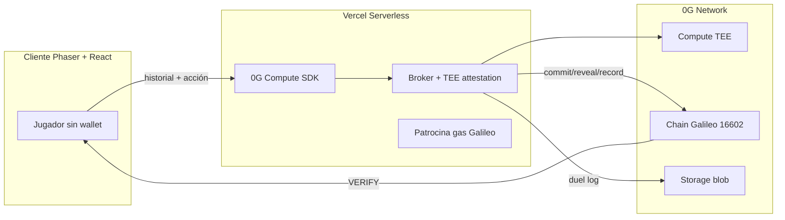

# ZEGON — Zero Cup Pitch Deck Source

> **Documento base para armar el pitch deck del Zero Cup (0G Global Vibe Coding Tournament).**  
> Todo lo que sigue está implementado en el repo público y es demostrable en vivo.

---

## Slide 0 — Una línea (el “efecto guau”)

**ZEGON es el primer duelo donde una IA a ciegas te lee por patrones… y vos podés probar on-chain que nunca espió tu jugada.**

Tagline: *"It can't see you. It reads you."* / *"No te ve. Te lee."*

---

## Slide 1 — El problema

Los juegos con oponente IA tienen un problema de confianza invisible:

- Si ZEGON “te leyó”, ¿realmente predijo tu patrón… o el servidor miró tu input antes de tiempo?
- “Provably fair” hoy es casi siempre **RNG** (dados, slots). Nadie verifica la **decisión de una IA con información oculta**.
- Sin prueba, “la IA no hace trampa” es solo marketing.

**Insight:** la justicia verificable no es un feature extra — es el producto.

---

## Slide 2 — La solución: ZEGON

Un duelo pixel-art **dark western + glitch** contra **ZEGON**, un pistolero IA con los ojos vendados (venda = TEE sellado de 0G).

| Lo que el jugador siente | Lo que pasa por debajo |
|--------------------------|------------------------|
| ZEGON sube una **racha de lectura** (2 ticks → DEADEYE letal) | Inferencia sellada en **0G Compute** con atestación TEE |
| Cada ronda: taunt → vos elegís DISPARAR / ESQUIVAR / ítem | **Commit on-chain** de la jugada de ZEGON **antes** de tu input |
| Al terminar: **VERIFY ON-CHAIN** | Reveal + timestamps + hash de atestación en **Galileo** |
| Opcional al final: conectar wallet → ranking global | **ZegonLeaderboard.sol** — mejor score por duelo, anti-spam por `duelId` |

**Jugá gratis.** Wallet solo al final si querés guardar puntaje en el ranking.

---

## Slide 3 — Demo en 60 segundos (guion para video / live)

1. **Entrar** → [zegon-dapp.vercel.app](https://zegon-dapp.vercel.app) — sin wallet, sin fricción.
2. **Tutorial** (9 lecciones + 6 rondas práctica) → enseña racha, DEADEYE, ítems en 1 click.
3. **Duelo** → repetí la misma jugada 2 veces → la racha sube → pantalla glitch → DEADEYE.
4. **Sorprendelo** → variá DISPARAR/ESQUIVAR → rompés la lectura.
5. **Resultado** → desglose de puntos + tips de ranking.
6. **VERIFY ON-CHAIN** → “13/13 rondas selladas antes de tu jugada” + link a Chainscan Galileo.
7. *(Opcional)* Conectar wallet → submit score on-chain al leaderboard global.

**Momento guau:** abrir el explorer y mostrar que el `commit` de ZEGON tiene timestamp **anterior** al momento en que el jugador eligió.

---

## Slide 4 — Gameplay (estado actual del build)

### Loop por ronda

```
Historial del jugador (solo pasado)
        ↓
0G Compute TEE → predicción + jugada de ZEGON + taunt
        ↓
commitMove(hash) en Galileo  ←── ANTES del input del jugador
        ↓
Jugador: DISPARAR | ESQUIVAR | ítem (HUMO / PLACA / ESPEJO)
        ↓
revealMove + resolución de daño (5 vidas = 5 corazones)
```

### Mecánicas clave

- **5 vidas** (UI en corazones/calaveras, no “−20 HP”).
- **Racha 2/2** → DEADEYE (próximo golpe letal si te leyó).
- **Ítems en 1 click:** Humo rompe lectura, Placa bloquea, Espejo refleja.
- **Modo Daily** + pool on-chain (`ZegonDailyPool.sol`) + ranking diario.
- **Modo Standard** con arquetipos de ZEGON (Reader, Gambler, etc.).
- **Puntuación transparente** al final: rondas, penalización por lecturas, bonus victoria, multiplicador racha diaria.
- **Logros**, tarjeta compartible, link de desafío.

---

## Slide 5 — Por qué esto NO es un bolt-on de 0G

> Criterio Zero Cup #01: *“0G has to do real work — if it runs the same without it, that's a bolt-on.”*

| Sin 0G | Con 0G (ZEGON) |
|--------|----------------|
| “Te leyó” = texto en pantalla | Inferencia **sellada** + atestación verificable |
| Commit-reveal = servidor de confianza | **Smart contract** `ZegonDuel.sol` en Galileo |
| Log del duelo = base de datos | **0G Storage** (blob) para reverificación |
| Ranking = JSON en servidor | **ZegonLeaderboard.sol** + fallback off-chain |

**Claim honesto que probamos:** ZEGON predice usando **solo tu historial**, sellado en TEE, y compromete su jugada **on-chain antes** de que muevas. No puede haber visto tu disparo actual ni cambiado la jugada después.

---

## Slide 6 — Stack 0G (los 3 pilares)



| Componente | SDK / contrato | Rol |
|------------|----------------|-----|
| **0G Compute** | `@0gfoundation/0g-compute-ts-sdk` | Cerebro de ZEGON + atestación TEE (`glm-5-fp8` u otro modelo en catálogo) |
| **0G Chain** | `ZegonDuel.sol`, `ZegonDailyPool.sol`, `ZegonLeaderboard.sol` | Commit-reveal, pool diario, ranking global |
| **0G Storage** | `@0glabs/0g-ts-sdk` | Log completo del duelo + attestations para audit |

**Red:** Galileo testnet · chainId `16602` · [chainscan-galileo.0g.ai](https://chainscan-galileo.0g.ai)

---

## Slide 7 — Arquitectura del repo (monorepo)

```
Zegon-DApp/
├── packages/game-core/      Lógica pura del duelo (tests Vitest)
├── packages/game-client/    Phaser 3 + React + Vite (UI pixel glitch)
├── packages/game-server/    API: Compute, chain, storage, leaderboard
├── contracts/               Solidity + Hardhat + tests
└── api/                     Vercel serverless entry
```

**Patrón clave:** el jugador **no paga gas**. El backend opera con wallet de servidor (`SERVER_WALLET_PRIVATE_KEY`) — viralidad first, Web3 cuando importa (verify + rank).

---

## Slide 8 — Contratos on-chain

| Contrato | Función |
|----------|---------|
| **ZegonDuel.sol** | `commitMove` → `revealMove` → `recordDuel` por ronda/duelo |
| **ZegonDailyPool.sol** | Stake OG para entrar al daily, claim por operador |
| **ZegonLeaderboard.sol** | `submitScore(score, duelId)` — mejor score por address, anti-replay por duelId, `getTopN` |

Deploy scripts: `contracts/scripts/deploy.ts`, `deploy-pool.ts`, `deploy-leaderboard.ts`  
Estado: `contracts/deployments/galileo.json`

---

## Slide 9 — Vibe coding (cómo lo construimos)

> Criterio Zero Cup #02: *“Vibe coding is the point.”*

- **Equipo:** Zegon Labs (2 builders + Claude Code / Cursor agents).
- **Metodología:** prompts iterativos → playtest → feedback → resubmit entre deadlines.
- **Ejemplos de vibe coding en este repo:**
  - Mecánicas de combate simplificadas tras playtest (ítems 1-click, vidas en corazones, racha 2/2).
  - UI de resultado rediseñada en una sesión tras feedback visual.
  - Contrato `ZegonLeaderboard` + integración cliente en el mismo sprint que UX polish.
- **Tests:** 40 tests game-core, 8 Hardhat (Duel + Leaderboard), build CI en Vercel.

**No es un fork fino:** greenfield durante la ventana del torneo (desde 15 jun), sobre libs open-source estándar.

---

## Slide 10 — Checklist Zero Cup (8 criterios)

| # | Criterio | Cómo lo cumple ZEGON |
|---|----------|----------------------|
| **01** | AI-native on 0G | Compute + Chain + Storage en el loop crítico del duelo |
| **02** | Vibe coding | Construido con copilots/agents; repo público auditable |
| **03** | Trabajo propio, ventana del torneo | Repo [Zegon-Labs/Zegon-DApp](https://github.com/Zegon-Labs/Zegon-DApp), commits desde jun 2026 |
| **04** | Repo público + demo viva | [Demo](https://zegon-dapp.vercel.app) + VERIFY real + código coincide |
| **05** | Deadlines = snapshot | Listos para lockear en Jun 23 / Jul 8 con `git tag` |
| **06** | Improve & resubmit | Playtest UX → leaderboard on-chain → i18n in-game → panel resultado |
| **07** | One team, one project | Zegon Labs → un solo submission ZEGON |
| **08** | No cheat | Demo verificable en explorer; sin claims falsos de TEE si backend está en dummy mode |

---

## Slide 11 — Diferenciación (por qué gana corazones y votos)

1. **Metáfora visual instantánea:** venda ciega = TEE. No hace falta slide de arquitectura para entenderlo.
2. **Tensión psicológica real:** no es “batalla por stats”, es *¿puedo dejar de ser predecible?*
3. **Prueba al final, no al inicio:** jugás como guest; Web3 es recompensa (verify + rank), no barrera.
4. **Glitch como feedback:** cuanto más te lee, más se rompe la pantalla — el medidor *es* la estética.
5. **Compartible:** tarjeta de resultado, link de desafío, ranking daily/global.
6. **Primero en categoría:** provably-fair para **decisiones de IA**, no solo RNG.

---

## Slide 12 — Métricas de integración (para jueces técnicos)

- **Por ronda:** 1 inferencia TEE + 1 commit tx (+ 1 reveal tx).
- **Por duelo:** `recordDuel` + upload Storage + endpoint `/api/duel/verify/:duelId`.
- **Health check:** `/api/health` expone `brainMode: tee | dummy`, contrato configurado, storage indexer.
- **Smoke tests:** `pnpm smoke:compute`, `pnpm smoke:galileo`.
- **Explorer:** cada tx linkeable desde UI → Chainscan Galileo.

---

## Slide 13 — Roadmap entre rondas (improve & resubmit)

| Prioridad | Siguiente entrega |
|-----------|-------------------|
| Alta | Video demo 90s: DEADEYE → VERIFY → explorer |
| Alta | `VITE_LEADERBOARD_CONTRACT_ADDRESS` en prod + deploy leaderboard Galileo |
| Media | Más arquetipos / armas con impacto en legibilidad |
| Media | iNFT / cosméticos on-chain (post-MVP) |
| Comunidad | Torneos comunitarios con seed compartida |

---

## Slide 14 — Links (para submission form)

| Recurso | URL |
|---------|-----|
| **Demo live** | https://zegon-dapp.vercel.app |
| **Repo público** | https://github.com/Zegon-Labs/Zegon-DApp |
| **Landing** | https://zegon-landing.vercel.app |
| **Explorer** | https://chainscan-galileo.0g.ai |
| **Verify page** | https://zegon-dapp.vercel.app/verify.html |
| **Faucet Galileo** | https://faucet.0g.ai |

---

## Slide 15 — Equipo

**Zegon Labs** — Zero Cup 2026  
Construyendo el duelo donde la IA no puede hacer trampa.

---

## Apéndice A — Copy listo para slides (ES / EN)

**Hook ES:**  
*ZEGON no tiene ojos. Tiene un TEE. Te lee por tus patrones — y vos podés verificar en Galileo que nunca espió tu disparo.*

**Hook EN:**  
*ZEGON is blindfolded by cryptography. It reads your patterns — and you can prove on-chain it never saw your shot.*

**CTA:**  
*Play free. Connect at the end to rank. Verify always.*

---

## Apéndice B — Preguntas que van a hacer (respuestas cortas)

**¿Qué pasa si 0G Compute falla?**  
Fallback a DummyBrain local/offline para jugar; en prod con `USE_OG_COMPUTE=true` el health bar muestra si estás en TEE real.

**¿El jugador necesita wallet?**  
No para jugar. Sí para daily stake, ranking on-chain y perfil con nickname.

**¿Cómo sé que el TEE recibió solo historial?**  
El prompt del servidor construye `RoundContext` con `playerHistory` — la acción actual se envía solo en reveal, después del commit. Verificable en logs + Storage.

**¿Es solo un wrapper de ChatGPT?**  
No. Es un juego completo (core logic testeado, Phaser client, commit-reveal contract, storage, leaderboard) donde el LLM es el cerebro de un personaje con reglas de juego verificables.

---

## Apéndice C — Estructura sugerida del deck (15 slides)

1. Título + tagline + screenshot DEADEYE  
2. Problema (confianza en IA)  
3. Solución en 1 diagrama  
4. Gameplay loop animado  
5. Demo video / GIF VERIFY  
6. 0G Compute (TEE)  
7. 0G Chain (commit-reveal)  
8. 0G Storage + Leaderboard  
9. “No bolt-on” comparison table  
10. Vibe coding + repo  
11. Zero Cup checklist ✓  
12. Traction / polish reciente (playtest UX)  
13. Roadmap  
14. Links + QR a demo  
15. Team + ask  

---

*Última actualización: commit `4005227` — playtest UX, score breakdown, ZegonLeaderboard, panel de resultados rectangular.*
